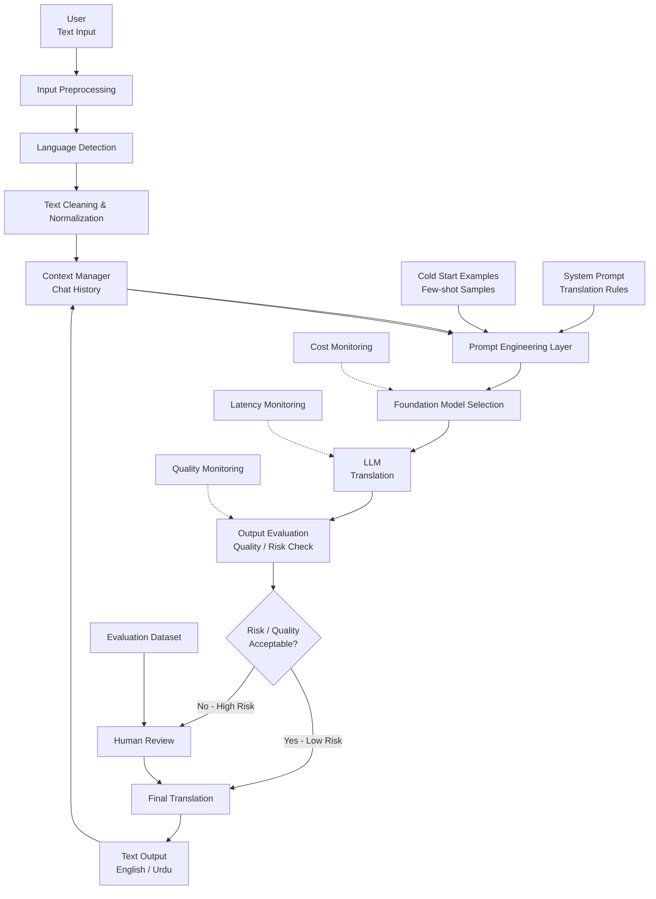

# Bilangual Engine: AI-Powered English ↔ Urdu Translation & Banking Dispute System

[](https://www.python.org/downloads/)
[](https://fastapi.tiangolo.com/)
[]()
[]()
[]()

> An enterprise-grade, context-aware AI translation and fintech dispute resolution pipeline strictly focused on bidirectional English <-> Urdu translation, with script identification, prompt engineering with frozen golden exemplars, deterministic risk evaluation, human-in-the-loop audit routing, and full telemetry observability (Cost, Latency, Quality).

---

## 1. System Architecture (The Complete Flowchart)



---

## 2. Key Architecture Nodes

| Node | Name | Description |
| :---: | :--- | :--- |
| **A** | **User Text Input** | Accepts raw text in English or Urdu script. |
| **B** | **Input Preprocessing** | Strips noise, sanitizes whitespace, and checks character limits. |
| **C** | **Language Detection** | Computes Unicode script ratios (`en`, `ur`) with confidence scoring and direction validation. |
| **D** | **Text Cleaning & Normalization** | Preserves financial tokens (`5000`, `25000`, dates) while cleaning excess punctuation. |
| **E** | **Context Manager** | Stateful sliding window memory (past 3-5 turns) with circular feedback loop from Node P. |
| **F** | **Prompt Engineering Layer** | Assembles System Prompt (H), Exemplars (G), and History (E) into structured JSON schema. |
| **G** | **Cold Start Examples** | 7 Frozen Golden Banking Dispute Scenarios (ATM jam, failed transfer, double charge, etc.). |
| **H** | **System Prompt & Rules** | Lexicon directives (e.g. *"current affairs"* -> *"کرنٹ افیئرز"*, never *"حالات حاضرہ"*). |
| **I** | **Foundation Model Selection** | Tiered model routing (`gemini-3.5-flash` with redundant fallback candidates). |
| **J** | **LLM Translation** | Async foundation model execution returning structured bilingual JSON. |
| **K** | **Output Evaluation** | Deterministic regex audit: numerical entity preservation ($P_{\text{num}} = 1.0$), state consistency, multipliers. |
| **L** | **Risk Decision Gate** | Zero-flag outputs -> Low Risk (M); Any discrepancy -> High Risk (N). |
| **M** | **Final Translation Gate** | Released translation text from either automated low-risk path or human audit path. |
| **N** | **Human Review (HITL)** | Interactive workbench allowing operators to **Accept**, **Correct** in-place, or **Reject**. |
| **O** | **Evaluation Dataset** | Persistent benchmark scenarios & logged human reviews (`data/evaluation_dataset.json`). |
| **P** | **Text Output** | Delivers final verified translation (English or Urdu) to user and feeds back into Context Manager (Node E). |
| **Q** | **Cost Monitoring** | Observability for prompt/completion tokens, cache savings, and estimated USD cost. |
| **R** | **Latency Monitoring** | Granular millisecond breakdown for preprocessing, language detection, LLM, and risk evaluation. |
| **S** | **Quality Monitoring** | Live tracking of pass rate (%), entity preservation rate (%), and human escalation counts. |

---

---

## 3. Prompt Architecture: Context -> Role -> Constraints

Node F constructs structured prompts following the industry-standard pattern:
* **Context:** Ingests conversation sliding window history (Node E), source text (Node A), upstream language hint (Node C), and 7 frozen golden exemplars (Node G).
* **Role:** Establishes the authoritative persona: *"You are Bilangual AI, an enterprise-grade Fintech Dispute Translation & Compliance Engine."*
* **Constraints:** Enforces hard boundaries: 100% numerical entity preservation ($P_{\text{num}} = 1.0$), debit/credit financial state consistency, modern lexicon rule (*"current affairs"* -> *"کرنٹ افیئرز"*), and strict JSON schema output.

---

## 4. The "CRAWL, WALK, RUN" Risk Assessment & HITL Model

The system implements the progressive maturity model:

* **CRAWL Stage: "By Self" (Deterministic Guardrails):**
  * *Human Role:* Verification by self during cold start, novel prompts, or deterministic rule failures.
  * *Mechanics:* Regex numerical entity matching ($P_{\text{num}} = 1.0$), debit/credit state consistency audit, script direction validation (<2ms, $0.00 cost).
* **WALK Stage: "Low Risk Context (Direct Messaging)":**
  * *Human Role:* Selective intervention. The system delivers **direct messaging** for verified, low-risk contexts (Node M -> P). Flagged high-risk contexts are routed to the Human Review Workbench (Node N).
  * *Mechanics:* Interactive review (Accept, Correct in-place, Reject) with feedback logging to `data/evaluation_dataset.json` (Node O).
* **RUN Stage: "Automate" (Production Telemetry & Observability):**
  * *Human Role:* Exception-based oversight and telemetry monitoring.
  * *Mechanics:* Full automated pipeline execution, real-time observability across Cost (Q), Latency (R), Quality (S), and model fallback.

---

## 5. Algorithmic Language Detection & Mathematical Cost Model

* **Language Detection (Node C):** Deterministic Unicode script pattern inspection (`\u0600-\u06FF` Arabic/Nastaliq vs `[a-zA-Z]` Latin). Computes script ratio and confidence score; blocks direction mismatches early at HTTP 400.
* **Cost Model (Node Q):** Gemini API rate ($0.075 / 1M prompt tokens, $0.30 / 1M completion tokens). Fresh translation averages $\approx \$0.000048$ per request; deterministic cache hits cost $\mathbf{\$0.000}$ ($100\%$ savings).

---

## 4. Quickstart & Installation

### Prerequisites
* Python 3.11+
* Active Google Gemini API Key (stored in `.env`)

### Setup
```bash
# Clone or navigate to the project directory
cd Bilangual

# Create and activate virtual environment
python -m venv venv
.\venv\Scripts\activate   # Windows

# Install dependencies
pip install -r requirements.txt
```

### Configure Environment Variables
Ensure `.env` contains:
```env
GEMINI_API_KEY=your_gemini_api_key_here
GEMINI_MODEL=gemini-3.5-flash
LOG_LEVEL=INFO
```

### Run Server
```bash
python -m uvicorn main:app --host 127.0.0.1 --port 8000 --reload
```
Open your browser at **`http://127.0.0.1:8000`** to access the user interface.

---

## 5. REST API Endpoints

* `POST /api/v1/translate`: Primary translation pipeline with direction validation (`en->ur` or `ur->en`), risk audit, and optional `user_id` / `username` tracking.
* `POST /api/v1/human-review`: Resolves flagged high-risk translations (Accept, Correct, Reject).
* `POST /api/v1/feedback`: Human-in-the-loop review feedback submission with user metadata.
* `GET /api/v1/history`: Persistent SQLite translation logs, filterable by `user_id`, `username`, or `session_id`.
* `GET /api/v1/users`: Fetches all registered users with translation activity counts.
* `POST /api/v1/users`: Creates a new user profile (`username`, `display_name`, `email`) for maintaining isolated history logs.
* `GET /api/v1/users/{user_id_or_name}`: Retrieves user profile details and activity statistics.
* `DELETE /api/v1/users/{user_id_or_name}`: Deletes user profile (protected for default system user).
* `DELETE /api/v1/users/{user_id_or_name}/history`: Clears translation history logs for a specific user.
* `GET /api/v1/metrics`: Live telemetry deck for Cost (Q), Latency (R), and Quality (S).
* `GET /api/v1/evaluation-dataset`: Inspects gold benchmark test cases and audited human reviews.
* `GET /api/v1/scenarios`: Returns the 7 frozen golden fintech dispute scenarios.
* `GET /api/v1/context/{session_id}`: Retrieves active conversation turn history.
* `DELETE /api/v1/context/{session_id}`: Flushes active conversation context.
* `GET /api/v1/health`: Service health and model status.

---

## 6. Multi-User History Management

The system supports multi-user tracking while preserving 100% of underlying translation, risk assessment, and telemetry functionality:
* **Zero Disruption / Backward Compatibility:** All existing endpoints (`/translate`, `/feedback`, `/history`) maintain full compatibility. Omitting user fields gracefully defaults to the system `default` user.
* **User Isolation:** Each user has their own tracked history in SQLite database (`bilangual_history.db`), accessible via user dropdown in the frontend or API filter parameters (`?username=...`).
* **Profile Switcher:** An interactive UI pill in the top header allows instant 1-click user switching and quick new profile creation without page reload.
* **Per-User Log Maintenance:** Users can inspect or clear their individual translation history without affecting other users' logs.

---

## 7. Documentation
For the complete 15-phase AI engineering specification, viva voce defense guide, and failure analysis, see:
* [`docs/PROJECT_PROPOSAL_SPECIFICATION.md`](docs/PROJECT_PROPOSAL_SPECIFICATION.md)
 
